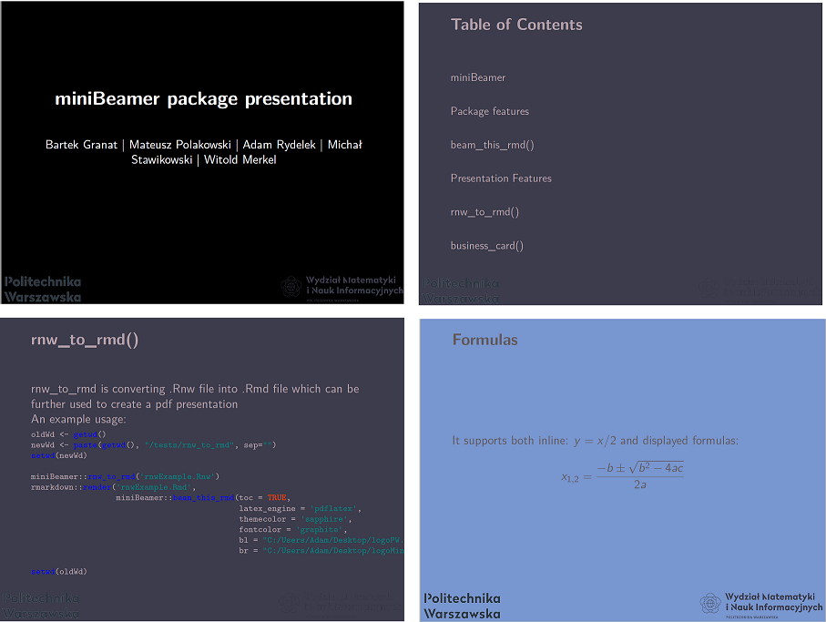

# miniBeamer

## miniBeamer PDF presentation with R Markdown

Get it from GitHub: https://github.com/mckraqs/miniBeamer

# Package features

## Package features

Create a MiNI WUT themed documents with following main features: 

1. Works in all modern browsers
2. Presentation fully keyboard accessible
3. Multiple themes available
4. Printable to PDF
5. RNW to RMD conversion
6. Business cards generator

# beam_this_rmd()

## beam_this_rmd()

beam_this_rmd() converting .Rmd file into beautiful MiNI WUT themed beamer presentation

An example usage:

```{r eval = FALSE}
rmarkdown::render('tests/prezentacja_pakietu.Rmd', 
    miniBeamer::beam_this_rmd(
      themecolor = 'sapphire',
      fontcolor = 'graphite',
      toc = FALSE,
      incremental = FALSE,
      fig_width = 9,
      fig_height = 6,
      fig_crop = TRUE,
      pandoc_args = NULL,
      bl = "BOTTOMLEFT",
      br = "BOTTOMRIGHT",
      highlight = "haddock",
      latex_engine = "xelatex",
      bl = "C:/Users/bgranat/Desktop/logoPW.png",
      br = "C:/Users/bgranat/Desktop/WMINIznak.png"))
```

## Example presentation

```{r eval = FALSE}
---
title: "miniBeamer RMD_TO_PDF initial presentation"
author: mckraqs
output: miniBeamer::beam_this_rmd
---

## miniBeamer PDF presentation with R Markdown

Get it from GitHub: https://github.com/mckraqs/miniBeamer

# R Markdown

## R Markdown

This is an R Markdown presentation. Markdown is a simple formatting syntax
for authoring HTML, PDF, and MS Word documents.
```

# Presentation Features

## Presentation Features

Let's dive more deeply into some of the presentation features!

## Different themes

{width=330px}


## Lists

1. 11.11.2019 Stoachastic Processes exam
1. 12.11.2019 HTML homework
1. 1.01.2020 PARTY!!!
* Drink juice
* Eat popcorn
* Go to sleep before midnight
1. 30.01.2020 ooops exams

## Formulas

It supports both inline: \(y = x / 2\) and displayed formulas:

  \[ x_{1,2} = \frac{- b \pm \sqrt{b^2 - 4ac}}{2a} \]

## Slide with quote

> Na tym przedmiocie nie nauczę was jak się robi aplikację... ale i tak będziecie musieli ją zrobić.

**Michał Okulewicz**

## Slide with R Code and Output

```{r}
print('Test1')
options(tibble.width = 120)
```

- Some text

```{r cache=TRUE}
super_complicated_equation_evaluation <- 2 + 2
super_complicated_equation_evaluation
```

## Tables

|           Przedmiot  |  Liczba godzin  |  ECTS  |  
  |:-----------------:|:-----:|:-----:|:------:|
  |     Analiza matematyczna 1     | 60    |   6   |   
  |   HTML   | 30    |   4   |  
  |    Procesy Stochastyczne    | 45  |   5   |    
  |   Rachunek Prawdopodobieństwa  | 60  |   6   |  
  | Zaawansowany R | 60  |   4   |


## Lists item by item

> 1. Lets you reveal list items one by one
> 2. To keep some key points
> 3. In secret from audience
> 4. But it will work only once
> 5. Nobody wants to see the same joke twice

## Never Gonna Give You Up


## Slide with Plot

```{r, echo=FALSE, dev='jpeg'}
# par(mar = c(5, 4, 1, 2) + 0.1)
# pairs(iris[1:4], pch = 21,
#       bg = c("red", "green3", "blue")[unclass(iris$Species)])
library(ggplot2)
x <- rnorm(10)
plot(x, x)
```

# rnw_to_rmd()

## rnw_to_rmd()

rnw_to_rmd is converting .Rnw file into .Rmd file which can be further used to create a pdf presentation

An example usage:

```{r eval = FALSE}
oldWd <- getwd()
newWd <- paste(getwd(), "/tests/rnw_to_rmd", sep="")
setwd(newWd)

miniBeamer::rnw_to_rmd('rnwExample.Rnw')
rmarkdown::render('rnwExample.Rmd', 
                  miniBeamer::beam_this_rmd(toc = TRUE,
                                            latex_engine = 'pdflatex',
                                            themecolor = 'sapphire',
                                            fontcolor = 'graphite',
                                            bl = "C:/Users/Adam/Desktop/logoPW.jpg",
                                            br = "C:/Users/Adam/Desktop/logoMini.png"))

setwd(oldWd)
```

# business_card()

## business_Card()

business_card() is converting .Rmd file into beautiful MiNI WUT themed business card

An example usage:

```{r eval = FALSE}
rmarkdown::render(
  'tests/business_card/business_card.Rmd', miniBeamer::business_card()
)
```

## Example business card

```{r eval = FALSE}
---
address: |
  @mckraqs
logo: "WMiNI-znak.png"
person:
  - name: Mateusz Polakowski
    title: Data Science, MiNI PW
    phone: "+48 997 998 999"
    email: mateusz.polakowski@mini.pw.edu.pl
    url: https://github.com/mckraqs/miniBeamer
cols: 1
rows: 1
output: miniBeamer::business_card
---
```

## WOW! WOW! This card is nice!


## Surprise


